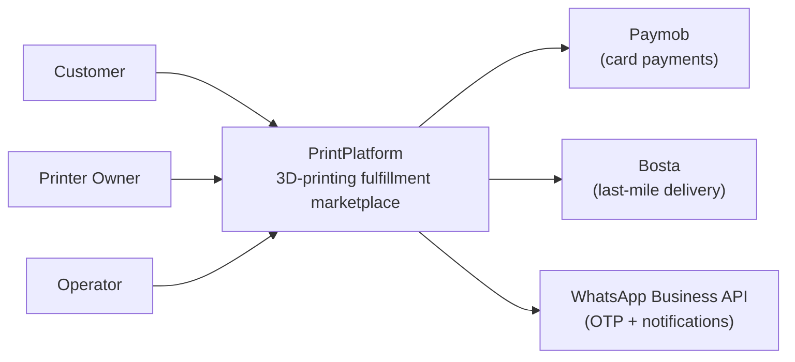
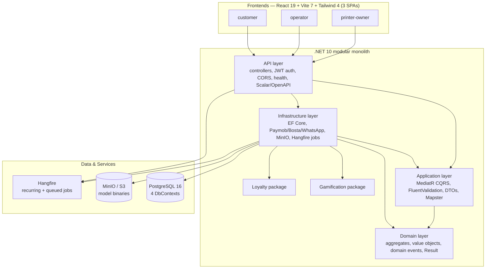
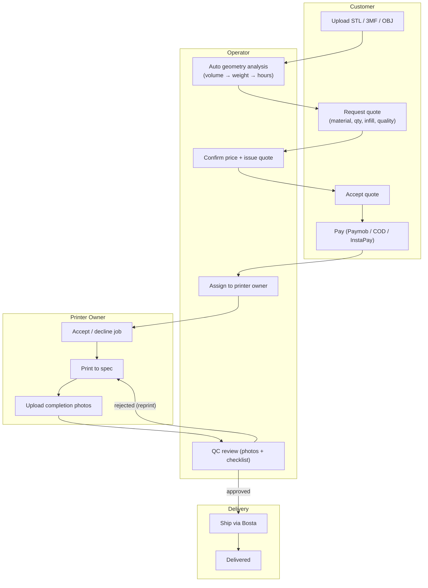
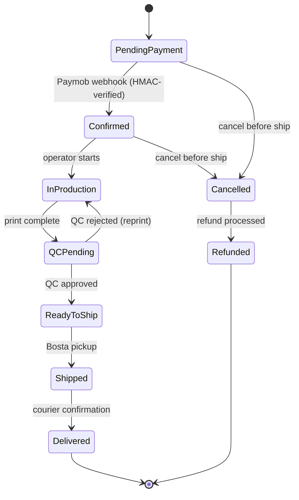
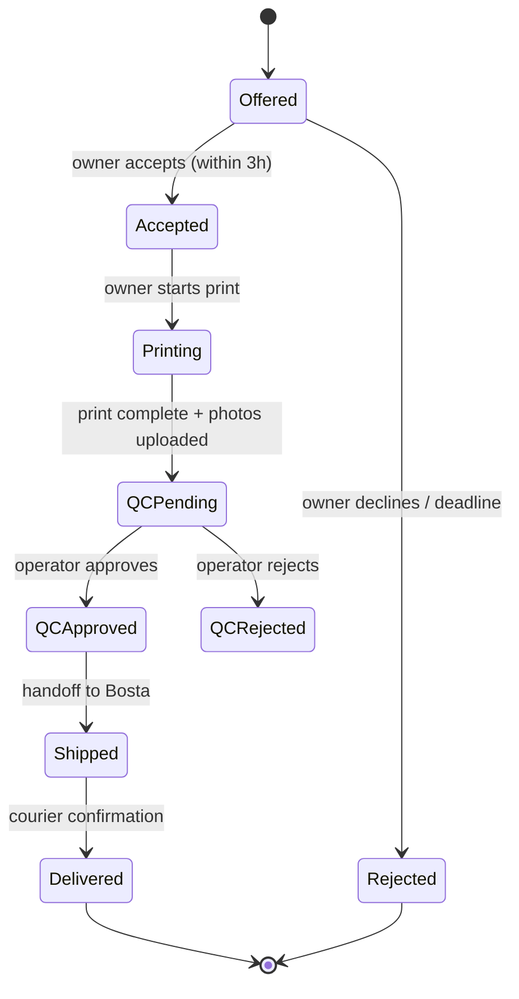
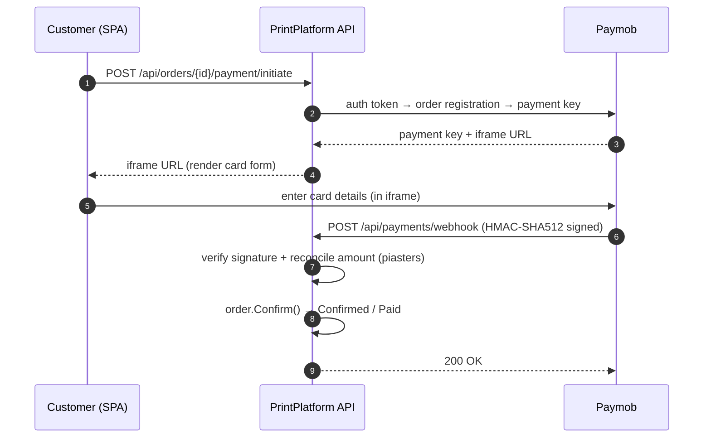
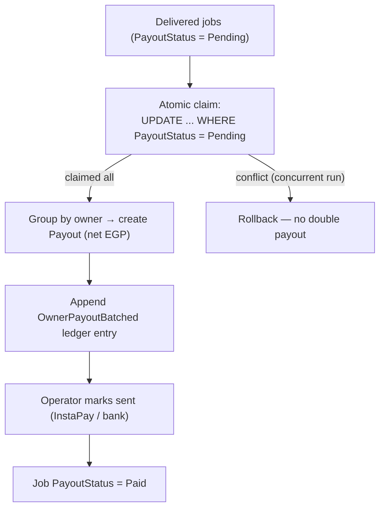

# PrintPlatform

**Egypt 3D-printing fulfillment marketplace** — a two-sided platform that connects customers who need 3D prints with a network of vetted printer owners, coordinated by operators who handle quoting, dispatch, quality control, payment, and payouts.

- Customers upload STL/3MF/OBJ models, get priced quotes, pay, and track delivery.
- Printer owners register machines + materials and earn income per completed job.
- Operators quote, assign, run QC, and settle payouts — all in Arabic (RTL) or English.

The codebase is a **modular ASP.NET Core monolith** (.NET 10, clean architecture) with three React frontends.

---

## Key Features

- **Geometry-aware pricing** — automatic STL/OBJ/3MF parsing computes volume → weight → print time, driving real cost-based quotes.
- **Two-sided workflow** — quote request → operator quote → customer acceptance → payment → dispatch → print → QC → delivery.
- **Egypt-native** — EGP pricing, Paymob (cards), Bosta (delivery), WhatsApp Business API (OTP + notifications), Arabic/RTL UI, national-ID KYC.
- **Marketplace & dispatch** — printer/material catalog, manual job assignment with acceptance deadlines, QC photo review.
- **Finance** — append-only ledger, customer payments, weekly owner payouts (InstaPay/bank), platform commission.
- **Engagement** — loyalty tiers + gamification (XP, levels, achievements, streaks, leaderboards).
- **Security** — JWT + refresh tokens, Paymob webhook HMAC verification, encrypted PII, role-gated Hangfire dashboard.

---

## Table of Contents

1. [Architecture](#architecture)
2. [Core Workflows](#core-workflows)
3. [Domain Model](#domain-model)
4. [API Surface](#api-surface)
5. [Tech Stack](#tech-stack)
6. [Getting Started](#getting-started)
7. [Configuration](#configuration)
8. [Testing](#testing)
9. [Deployment](#deployment)
10. [Security](#security)
11. [License](#license)

---

## Architecture

### System Context (C4 — Level 1)



### Containers (C4 — Level 2)

The backend is a **modular monolith** (one deployable, four clean-architecture layers) rather than microservices — modules are isolated by convention via auto-registration, not by process.



### Repository Layout

```
src/
  PrintPlatform.API/            # ASP.NET Core host, controllers, middleware, Program.cs
  PrintPlatform.Application/    # Commands/queries (CQRS), handlers, validators, DTOs
  PrintPlatform.Domain/         # Aggregates, value objects, domain events, Result<T>
  PrintPlatform.Infrastructure/ # EF Core, integrations, storage, background jobs, module installers
  packages/
    PrintPlatform.Gamification/ # Reusable gamification (XP, levels, achievements)
    PrintPlatform.Loyalty/      # Reusable loyalty (tiers, points, referrals)

tests/                          # xUnit: Domain, Application, Gamification, Loyalty

frontend/
  customer/                     # Upload models, request quotes, pay, track orders
  operator/                     # Quote, dispatch, QC, payouts, analytics
  printer-owner/                # Accept jobs, print, upload QC photos, earnings
```

Modules register themselves through `IModuleInstaller` (scanned at startup) and own a `partial AppDbContext` + EF `IEntityTypeConfiguration<T>` — new modules never edit shared files.

---

## Core Workflows

### End-to-end order journey



### Order lifecycle



### Print job lifecycle (dispatch)



### Payment flow (Paymob)



### Weekly payout flow



---

## Domain Model

The platform is organised around these business areas:

| Area | Purpose |
| --- | --- |
| **Identity** | Customer + printer-owner registration, login, refresh tokens, OTP verification, profile onboarding (national-ID KYC) |
| **Marketplace** | Printer registration, materials, availability, verification, dispatch candidates |
| **Models & Quotes** | Model upload, geometry analysis, quote requests, operator quoting, customer acceptance |
| **Orders** | Order lifecycle, payment initiation, cancellation |
| **Dispatch** | Job assignment, accept/reject, print start, completion photos, QC approve/reject |
| **Finance** | Customer payments, refunds, owner earnings, weekly payouts, append-only ledger |
| **Loyalty** | Member records, tiers, rewards, points ledger, referrals |
| **Gamification** | Player records, XP, levels, achievements, challenges, streaks, leaderboards |
| **Webhooks** | WhatsApp verification/callbacks + Paymob payment webhooks |

---

## API Surface

```
/api/auth           register (customer / printer-owner), login, refresh, revoke, verify-otp
/api/profile        profile read/update
/api/models         upload model files
/api/quotes         quote requests, operator quoting, accept
/api/orders         order lifecycle, payment initiation, cancel
/api/dispatch       assign, accept/reject, print, QC, ship
/api/finance        payments, refunds, payouts, ledger
/api/printers       printer registration + availability
/api/materials      material catalog
/api/payments       Paymob payment webhook
/api/webhooks       WhatsApp verification + notifications
/api/loyalty        loyalty program
/api/achievements   gamification
/health/live        liveness
/health/ready       readiness (DB + storage)
```

OpenAPI is generated via Scalar (`/scalar/v1` in Development).

---

## Tech Stack

### Backend

| Concern | Technology |
| --- | --- |
| Runtime | .NET 10 (ASP.NET Core) |
| Persistence | Entity Framework Core 10 → PostgreSQL 16 |
| CQRS / Mediator | MediatR |
| Validation | FluentValidation |
| Mapping | Mapster |
| Background jobs | Hangfire (PostgreSQL storage) |
| Logging | Serilog |
| API docs | Scalar / OpenAPI |
| Object storage | MinIO (S3-compatible, AWS SDK) |
| Auth | JWT (HS256) + refresh tokens, ASP.NET Identity |
| Payments | Paymob |
| Delivery | Bosta |
| Messaging | WhatsApp Business API |
| Testing | xUnit, FluentAssertions, NSubstitute, Testcontainers |

### Frontend (×3 apps)

| Concern | Technology |
| --- | --- |
| UI | React 19 + TypeScript |
| Build | Vite 7 |
| Styling | Tailwind CSS 4 (CSS-first, native RTL) |
| Server state | TanStack Query |
| Forms | React Hook Form + Zod |
| i18n | i18next (Arabic RTL default, English) |
| 3D preview | three.js |
| Lint | ESLint 9 (flat config) |

### Infrastructure

Docker Compose: `api` + `postgres:16` + `minio`.

---

## Getting Started

### Prerequisites

- .NET 10 SDK
- Docker Desktop
- Node.js 20.19+ (or 22.12+)
- npm

### 1. Clone

```bash
git clone https://github.com/csa7mdm/printplatform.git
cd printplatform
```

### 2. Start infrastructure

```bash
docker compose up -d postgres minio
```

### 3. Configure

```bash
cp .env.example .env
```

Set at minimum:

| Variable | Purpose |
| --- | --- |
| `JWT_SECRET` | JWT signing key (≥ 32 random chars) |
| `SeedData__Admin__Email` / `__Password` | Admin account (required — no default) |
| `Paymob__HmacSecret` | Paymob webhook signature secret (required for payments) |

### 4. Run the backend

```bash
dotnet restore
dotnet run --project src/PrintPlatform.API
```

On startup the API applies EF migrations and (outside Production) seeds reference data + an admin.

### 5. Run a frontend

```bash
cd frontend/customer
npm install
npm run dev
```

Repeat for `frontend/operator` and `frontend/printer-owner` (ports 3001 / 3003 by default).

### Useful commands

| Command | Description |
| --- | --- |
| `dotnet build` | Build the solution |
| `dotnet test` | Run tests (per test project — see [Testing](#testing)) |
| `make migrate` | Apply EF migrations (in-container) |
| `npm run build` | Type-check + build a frontend |
| `npm run lint` | Lint a frontend (ESLint 9 flat config) |

---

## Configuration

Full reference lives in `.env.example`. Key sections:

- **Connection strings** — `DefaultConnection` (app), `HangfireConnection`, `Gamification`, `Loyalty`.
- **Jwt** — `Secret`, `Issuer`, `Audience`, `AccessTokenMinutes`, `RefreshTokenDays`.
- **Storage** — MinIO endpoint, access/secret key, bucket, `UseHttps`.
- **Paymob** — `ApiKey`, `IntegrationId`, `IframeId`, `HmacSecret`.
- **Bosta** — `ApiKey`, `BaseUrl`.
- **WhatsApp** — `Token`, `PhoneNumberId`, `VerifyToken`.
- **SeedData:Admin** — `Email`, `Password`, `FullName` (required for seeding; no hardcoded fallback).
- **QuotePricing** / **ModelAnalysis** — pricing and geometry-analysis constants (sane defaults provided).

> Secrets are environment-driven; never commit real values. Production uses the platform secret store.

---

## Testing

```bash
# Unit tests (no external dependencies)
dotnet test tests/PrintPlatform.Domain.Tests
dotnet test tests/PrintPlatform.Gamification.Tests
dotnet test tests/PrintPlatform.Loyalty.Tests

# Integration tests (require Docker for Testcontainers)
dotnet test tests/PrintPlatform.Application.Tests
```

The integration harness is "host-less" (no HTTP layer) and spins up PostgreSQL via Testcontainers. The full 12-step `OrderFlowIntegrationTest` is still a stub — see the roadmap.

---

## Deployment

The repo ships a multi-stage [Dockerfile](Dockerfile) (build → publish → non-root runtime) and a [docker-compose.yml](docker-compose.yml) (api + postgres + minio). CI builds/pushes a `ghcr.io` image on `main`.

Production checklist:

1. Run migrations at boot (already wired) — or a controlled migration step.
2. Provision `SeedData:Admin` + all integration secrets through the secret store.
3. Set `Cors:AllowedOrigins` to the three production frontend URLs.
4. Review the Egypt compliance notes in [docs/COMPLIANCE_EGYPT.md](docs/COMPLIANCE_EGYPT.md).

---

## Security

- **JWT (HS256)** with issuer/audience/lifetime/signing-key validation; refresh tokens are SHA-256-hashed at rest.
- **Paymob webhook HMAC-SHA512** verified before any state change, plus amount reconciliation.
- **WhatsApp webhook** `X-Hub-Signature-256` verification.
- **PII encryption** (national ID, payout details) via ASP.NET Data Protection.
- **Role-gated** Hangfire dashboard (Admin only).
- **Atomic payout claim** prevents double-payout under concurrency.
- **Dependency hygiene** — `dotnet list package --vulnerable` and `npm audit` are clean across backend + frontends.

---

## License

[Business Source License 1.1](LICENSE) — source-available. Free for non-production use; converts to Apache-2.0 on 2030-06-20. See the [LICENSE](LICENSE) file for the full terms.
